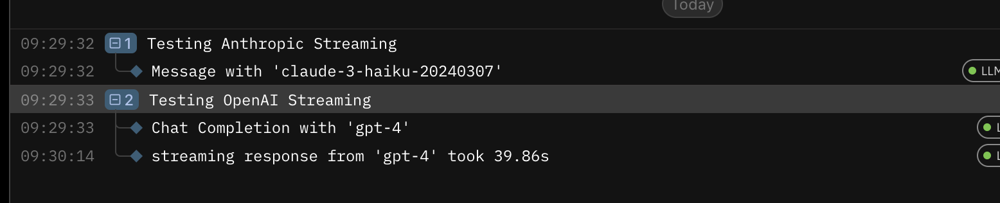

# Logfire Bug Reproduction Repository

This repository is designed to help reproduce a bug in the Logfire library when logging streaming responses from Anthropic API calls.

## Setup

To get started, ensure you have [Poetry](https://python-poetry.org/) installed on your system. Poetry is used for dependency management and packaging in this project.

1. **Install dependencies**:
    ```sh
    poetry install
    ```

2. **Run the streaming test**:
    ```sh
    poetry run python streaming_test.py
    ```

## Description

This repository contains scripts to test the integration of Logfire with OpenAI and Anthropic APIs. The `streaming_test.py` script demonstrates how to instrument API calls and handle streaming responses using Logfire.

### Files

- `streaming_test.py`: Contains the main test script that sets up clients for OpenAI and Anthropic, configures Logfire, and runs streaming tests for both APIs.

### Usage

The `streaming_test.py` script will run two tests:
- **Anthropic Streaming Test**: Sends a request to the Anthropic API and streams the response, displaying it in real-time using Rich's Live and Markdown components.
- **OpenAI Streaming Test**: Sends a request to the OpenAI API and streams the response, displaying it in real-time using Rich's Live and Markdown components.

You should see the following output in the logfire dashboard:



This is unexpected because the Anthropic streaming response is not logged.

## Dependencies

```
annotated-types==0.7.0
anthropic==0.40.0
anyio==4.7.0
certifi==2024.8.30
charset-normalizer==3.4.0
Deprecated==1.2.15
distro==1.9.0
executing==2.1.0
googleapis-common-protos==1.66.0
h11==0.14.0
httpcore==1.0.7
httpx==0.28.1
idna==3.10
importlib_metadata==8.5.0
jiter==0.8.2
logfire==2.7.1
markdown-it-py==3.0.0
mdurl==0.1.2
openai==1.57.4
opentelemetry-api==1.29.0
opentelemetry-exporter-otlp-proto-common==1.29.0
opentelemetry-exporter-otlp-proto-http==1.29.0
opentelemetry-instrumentation==0.50b0
opentelemetry-proto==1.29.0
opentelemetry-sdk==1.29.0
opentelemetry-semantic-conventions==0.50b0
packaging==24.2
protobuf==5.29.1
pydantic==2.10.3
pydantic_core==2.27.1
Pygments==2.18.0
requests==2.32.3
rich==13.9.4
sniffio==1.3.1
tqdm==4.67.1
typing_extensions==4.12.2
urllib3==2.2.3
wrapt==1.17.0
zipp==3.21.0
```
